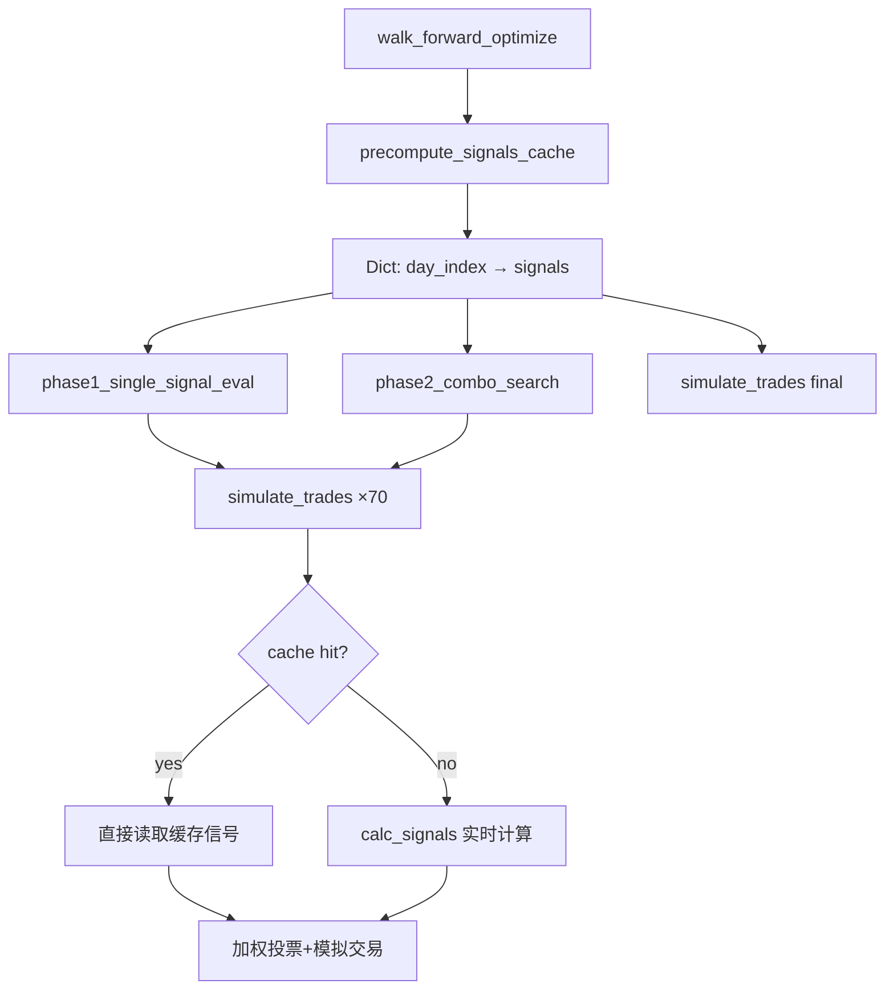

## 产品概述

对现有回测引擎进行性能优化，当前6只自选股完整回测需数百万次信号计算导致极慢，需在不降低分析能力的条件下大幅提速。

## 核心功能

- **信号预计算缓存**：每只股票的K线数据在整个回测流程中被1,653次交易模拟反复使用，但每天的信号从未缓存。通过预计算+缓存，将每只股票的信号计算从50万次降至约300次
- **修复Regime循环冗余**：walk_forward_optimize()中trending/ranging/volatile三个regime各自重跑完整Phase1+Phase2（各413次simulate_trades），但传入的是同一份未过滤的kdata_sorted，三份结果完全相同。消除此冗余可减少75%计算量
- **NumPy向量化热点**：将calc_signals()中_ema()的Python递推循环、MACD信号线O(n²)计算、Bollinger标准差等改用NumPy批量运算

## Tech Stack

- Python 3.x + NumPy（已有依赖）
- 修改范围：`scripts/backtest_engine.py`、`scripts/signals.py`

## 实现方案

### 整体策略：三轮递进优化，保持分析能力完全不变

优化逻辑：每只股票的回测流程实际只需要计算一次每日信号（~300天），剩下的1,652次simulate_trades()都是在不同权重组合下重复"投票+模拟交易"的轻量操作。当前每次simulate_trades()都在重算信号，这是核心浪费。

### Round 1：预计算信号缓存（预期提速 100-200×，最大收益）

**原理**：在walk_forward_optimize()入口一次性预计算所有天数的calc_signals()结果，存入`Dict[int, dict]`（key=日期索引）。之后所有simulate_trades()、phase1/phase2调用时直接从缓存读取，不再调用calc_signals()。

**实现步骤**：

1. 在backtest_engine.py新增`precompute_signals_cache(kdata_sorted)`函数

- 按simulate_trades()相同的滑动窗口逻辑（i-200:i+1，revsersed），对每个满足i>=26的天计算并缓存信号
- 返回`Dict[int, dict]`，key为日期索引i，value为calc_signals()返回值

2. 修改`simulate_trades()`签名新增可选参数`signals_cache: Dict[int, dict] = None`

- 当cache非空时，直接从缓存`signals_cache[i]`读取，跳过calc_signals()调用
- 当cache为空时保持原有逻辑（向后兼容）

3. 修改`phase1_single_signal_eval()`、`phase2_combo_search()`签名，增加`signals_cache`参数并透传
4. 修改`walk_forward_optimize()`：在入口处调用`precompute_signals_cache(kdata_sorted)`，传递给所有下游函数
5. **保持regime循环不变**（Round 2单独处理），复用同一份缓存即可

### Round 2：修复Regime循环冗余（预期再提速 4×）

**原理**：当前第271-278行的regime循环对trending/ranging/volatile各跑一次完整Phase1+Phase2，但传入的都是同一份kdata_sorted，从未按regime过滤。3次产出完全相同的结果。

**实现方案（两种选择）**：

- **推荐**：移除3倍循环，仅保留一次Phase1+Phase2计算，然后将结果作为所有3个regime的权重（因为当前实现下它们本就相同）。保留regime_weights字典结构以维持向外接口兼容性
- 备选：如果真的需要regime特定权重，需先实现kdata按regime过滤的逻辑（对每日标记regime类型，然后仅保留属于该regime的天数）。但这属于功能增强而非性能优化

选择方案1（移除冗余），并添加注释说明regime特定过滤逻辑留待后续实现。

### Round 3：NumPy向量化calc_signals()热点（预期再提速 3-5×）

**原理**：将calc_signals()中Python纯循环的热点路径替换为NumPy批量操作。

**具体修改**（`scripts/signals.py`）：

1. 新增`_ema_np(closes: np.ndarray, n: int) -> np.ndarray`：利用NumPy的指数加权递推公式一次性计算完整EMA序列，消除Python for循环
2. MACD部分（第152-159行）：用`_ema_np`批量计算ema12和ema26序列，直接取最后一个元素和倒数几个元素，消除O(n²)的列表推导式`[_ema(closes[:i+1], 12) for i in range(8,33)]`
3. Bollinger部分（第162-163行）：用`np.std(closes[:20], ddof=0)`替代`math.sqrt(sum((x-bb_ma)**2)/n)`
4. RSI部分（第147-150行）：用`np.array`切片和向量化sum替代for循环
5. ATR/ADX部分：保持原有用`HAS_NUMPY`已有的numpy路径，确保纯Python回退路径不受影响

**约束**：保持`HAS_NUMPY=False`时的纯Python回退路径完整可用，新增的numpy路径仅在`HAS_NUMPY=True`时生效。

### 性能预期

| 阶段 | 每只股票 calc_signals 调用 | 累计提速 |
| --- | --- | --- |
| 优化前 | ~500,000 次 | 1× |
| Round 1（缓存） | ~300 次 | 100-200× |
| Round 2（去冗余） | ~300 次（simulate_trades减少75%） | 4× 叠加 |
| Round 3（向量化） | ~300 次（单次更快） | 3-5× 叠加 |
| **总计** | — | **预期 30-50× 综合提速** |


6只股票从原来的分钟级降低到数秒级别。

## 实现注意事项

### 性能

- 信号缓存的key使用日期索引int，dict查找O(1)，无额外性能开销
- precompute_signals_cache()本身只调用~300次calc_signals()（与优化前每只股票50万次对比可忽略）
- NumPy向量化操作在大量数据上比Python循环快10-50倍

### 向后兼容

- simulate_trades()的signals_cache参数有默认值None，不传时保持原有行为
- calc_signals()的所有修改均保持返回格式完全不变
- 保留HAS_NUMPY=False时的纯Python回退路径

### 结果一致性

- 缓存中的信号值与原calc_signals()实时计算结果完全一致（同一输入同一输出）
- 移除的regime循环不会改变结果（因3次本就产出完全相同的结果）
- 需在优化前后用小数据集对比验证sharpe/max_dd等指标一致

## 架构设计



原流程中H→J执行了1653次/股，优化后H→I执行1653次/股而H→J仅执行0次（缓存全覆盖）。

## 目录结构

```
scripts/
├── backtest_engine.py    # [MODIFY] 新增precompute_signals_cache()函数；
│                         #   simulate_trades()增加signals_cache参数；
│                         #   phase1/phase2增加signals_cache透传参数；
│                         #   walk_forward_optimize()集成缓存+修复regime循环
├── signals.py            # [MODIFY] 新增_ema_np()向量化EMA函数；
│                         #   calc_signals() MACD/Bollinger/RSI热点替换为NumPy操作；
│                         #   保持HAS_NUMPY=False回退路径不变
└── db_helper.py          # 无需修改
```

## Key Code Structures

### precompute_signals_cache 接口

```python
def precompute_signals_cache(kdata_sorted: list, cfg: BacktestConfig) -> Dict[int, dict]:
    """
    预计算所有天的信号缓存。仅计算 satisfy i>=26 且在 simulate_trades() 范围内的天。
    
    Args:
        kdata_sorted: 按日期升序排列的K线数据 [date, open, close, high, low]
        cfg: 回测配置，用于确定 train_window 等参数
    
    Returns:
        Dict[int, dict]: key=日期索引i, value=calc_signals()返回值
    """
    ...
```

### simulate_trades 签名变更

```python
def simulate_trades(kdata: list, weights: Dict[str, Dict[str, float]],
                    cfg: BacktestConfig, regime: str = None,
                    signals_cache: Dict[int, dict] = None) -> BacktestMetrics:
```

### calc_signals 内部 NumPy 热点替换（仅HAS_NUMPY=True时生效）

- `_ema(closes, n)` → 使用 `_ema_np(np.array(closes), n)[-1]` 一次取得最终EMA值
- MACD信号线列表推导 → 使用 `_ema_np` 批量生成完整EMA序列后切片
- Bollinger std → `np.std(closes_array[:20], ddof=0)`