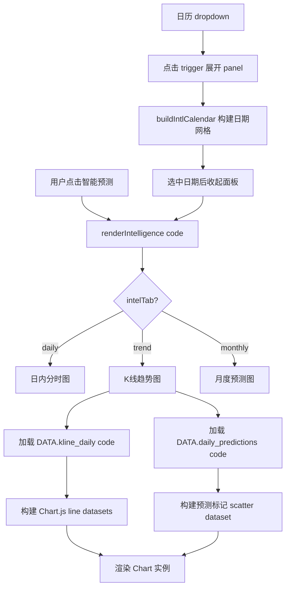

## 产品概述

为智能预测模块开发全新的K线趋势走势图组件。利用现有2000条日K数据，渲染流畅的历史K线图表，并在其上叠加预测数据标记，直观对比预测与实际的偏差。日历组件采用新闻动态页面的dropdown面板模式，保持交互与视觉的一致性。

## 核心功能

1. **K线趋势图**：基于2000条日K数据绘制收盘价曲线（蓝色实线）+ SMA均线 + 成交量/振幅参考，覆盖8年历史数据（2018-2026），保持与现有K线页相同的渲染性能
2. **预测叠加**：在K线图上用橙色圆点标记已回填预测的日期，hover显示预测方向/置信度/命中结果；选中日期后显示预测详情面板
3. **日历组件（dropdown模式）**：使用新闻页的ndp-trigger/ndp-panel下拉面板风格，点击按钮展开日历、选中日期后自动收起，面板仅在有预测数据的股票下显示，按年月翻页
4. **三tab切换**：保留日内视图（6时段分时图）+ 新增K线趋势（2000条日K+预测叠加）+ 月度视图（12月历史+6月预测）

## 交互逻辑

- 日历默认显示"今日"，下拉面板中仅高亮有预测数据的日期
- 选中日期后，K线图自动滚动/高亮到对应位置（通过Chart.js scale定位）
- 预测点hover显示tooltip：预测方向、置信度、实际结果（命中/未命中/待验证）
- 股票切换时日历和图表联动刷新

## 技术栈

- 前端框架: 原生 JavaScript（保持与项目一致）
- 图表库: Chart.js (chart.umd.min.js，已加载)
- 样式: CSS3（app.css 增量修改）
- 数据源: API `/api/v2/kline/daily?code=xxx` + DATA.daily_predictions

## 实现方案

### 1. 日历组件改造（dropdown模式）

参考news.js的`ndp-trigger/ndp-panel`模式，替换当前始终可见的`intel-cal`内联网格：

**HTML结构**：

```html
<div class="news-date-drop" id="intel-date-drop">
  <div class="ndp-wrapper">
    <div class="ndp-trigger" onclick="intelToggleDatePicker(event)">
      <span class="ndp-trigger-icon">📅</span>
      <span class="ndp-trigger-text" id="intel-date-text">选择日期</span>
      <span class="ndp-trigger-arrow">▾</span>
    </div>
    <div class="ndp-panel" id="intel-date-panel">
      <div class="ndp-nav">
        <button class="ndp-nav-btn" onclick="intelDatePrevMonth()">◀</button>
        <span class="ndp-nav-title" id="intel-nav-title"></span>
        <button class="ndp-nav-btn" onclick="intelDateNextMonth()">▶</button>
      </div>
      <div class="ndp-weekdays"><span>一</span>...<span>日</span></div>
      <div class="ndp-days" id="intel-days"></div>
    </div>
    <span class="ndp-status" id="intel-date-status"></span>
  </div>
</div>
```

复用app.css中已有的`.ndp-*`样式族（第257-293行），仅调整容器宽度为264px与新闻面板一致。有预测数据的日期使用`.ndp-day.has-news`标记（蓝色圆点），今日使用`.ndp-day.today`，选中使用`.ndp-day.selected`。

### 2. K线趋势图（新增tab）

在现有`#intel-chart-tabs`中新增"趋势"按钮，实现`switchIntelTab('trend')`：

**图表渲染策略**：

- 销毁旧Chart实例后重建
- 数据集1: 收盘价曲线（蓝色#2563eb, borderWidth:2）
- 数据集2: SMA20均线（橙色虚线#f59e0b, borderDash:[4,2]）
- 数据集3: SMA60均线（红色虚线#ef4444, borderDash:[6,3]）
- 数据集4: 预测日标记（橙色三角散点#f97316, pointRadius:8, showLine:false）——仅在有预测数据的日期显示

**性能优化策略**：

- X轴使用`ticks.maxTicksLimit:12`限制标签密度
- 使用`decimation`插件（Chart.js内置）自动抽稀数据点
- 仅最近20条预测需要标记渲染，使用稀疏数据数组

### 3. 预测叠加计算

遍历`DATA.daily_predictions[code]`，建立日期→预测的映射表：

```javascript
var predMap = {};
allPreds.forEach(function(p) {
  predMap[p.date] = p;
});
```

对每条K线的日期索引，查找是否有对应预测，有则将收盘价作为标记点的y值：

```javascript
var predPoints = closes.map(function(c, i) {
  return predMap[labels[i]] ? c : null;
});
```

hover时使用Chart.js plugin（参考kline.js的klineXPlugin十字光标模式），在tooltip中显示预测信息。

### 4. 各tab展示逻辑

| tab | 内容 | 数据源 |
| --- | --- | --- |
| 日内 | 6时段分时预测图（现有逻辑保留） | pred.hourly |
| 趋势 | 2000条日K + 预测标记 | DATA.kline_daily[code] + DATA.daily_predictions |
| 月度 | 12月K线 + 6月季节预测 + 实际收盘散点 | DATA.kline[code] + DATA.daily_predictions + DATA.seasonal[code] |


## 修改文件清单

| 文件 | 操作 | 说明 |
| --- | --- | --- |
| `deliverables/bank-stock-system.html` | 修改 | 替换intel-date-select为dropdown日历容器，新增intel-date-status状态标签 |
| `deliverables/css/app.css` | 修改 | 删除旧intel-cal样式族（215-234行），新增intel-trend-chart容器样式和日历状态文字样式 |
| `deliverables/js/intelligence.js` | 重写 | 新增dropdown日历函数、K线趋势渲染函数、三tab切换逻辑 |


## 架构设计



## 设计风格

保持项目现有设计语言：白色卡片+浅灰背景(#f0f2f5)，蓝色主色调(#2563eb)，12px圆角卡片。日历组件与新闻页面的dropdown日历完全一致（ndp风格），统一的交互体验。

## 页面结构

智能预测页面从上到下依次为：顶部栏（股票标签 + dropdown日历 + 刷新按钮）→ 三列卡片（次日预测/6月展望/关键价位）→ 走势图卡片（日内/趋势/月度三tab）→ 操作建议 → 技术信号（折叠面板）→ 历史命中网格

## K线趋势图设计

- 图表高度380px（与chart-box一致），响应式
- 蓝色收盘价线 + 橙色虚线SMA20 + 红色虚线SMA60
- 预测日标记为橙色三角散点，hover显示预测信息
- 十字光标跟随（参考kline.js的klineXPlugin实现）
- 底部X轴显示年份标签，顶部图例显示数据集切换

## Dropdown日历设计

- trigger按钮与新闻页一致的样式：📅图标 + 日期文字 + ▾箭头
- 面板结构与.ndp-panel一致：导航栏（◀标题▶）+ 星期头（一至日）+ 日期网格
- 有预测数据的日期显示蓝色圆点标记
- 选中日期后面板自动关闭，trigger文字更新为选中日期