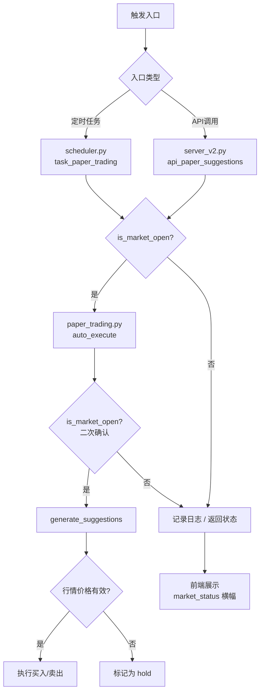

## 用户需求

纸面交易（模拟交易）功能缺少开市时间检查，在非交易时段（如开盘前、收盘后、周末）仍会执行买入/卖出操作，且行情价格可能未更新，导致使用过期或无效价格进行交易。

## 核心功能

- **开市时间检查**：在纸面交易执行前，校验当前是否处于A股交易时段（周一至周五 9:30-11:30, 13:00-15:00），非交易时段拒绝执行
- **行情新鲜度检查**：在生成交易建议时，校验股票行情价格是否有效（非0、非回退到 entry_zone 预测值），无有效行情的股票不生成买入/卖出建议
- **API层防护**：`/api/v2/paper/suggestions` 接口在自动执行前检查市场状态，返回 `market_status` 字段告知前端当前状态
- **前端状态提示**：PaperTrading 页面展示市场状态（已开市/已闭市/非交易日），让用户理解为何交易未执行

## 技术栈

- 后端：Python + FastAPI（server_v2.py）
- 脚本：Python（paper_trading.py, scheduler.py）
- 前端：Vue 3 + TypeScript（PaperTrading.vue）
- 数据库：SQLite（quotes表、paper_suggestions表）

## 实现方案

### 整体策略

新建 `scripts/market_utils.py` 市场工具模块，提供 `is_market_open()` 函数，然后在纸面交易的三个入口（定时任务、API调用、自动执行）全部增加市场时间检查，形成一个多层防护体系。

### 核心设计决策

1. **新建独立模块 `market_utils.py`**：市场时间判断逻辑独立封装，与业务逻辑解耦。选择新建模块而非内联在 paper_trading.py 中，因为 `server_v2.py` 和 `scheduler.py` 也需要复用此逻辑，避免代码重复。

2. **多层防护而非单点拦截**：

- `auto_execute()` 头部检查（最后防线，确保即使被其他方式调用也不会在非交易时段执行）
- `api_paper_suggestions()` API层检查（第一道防线，直接返回状态给前端）
- `task_paper_trading()` 调度器检查（兜底防线，定时任务层面的二次确认）
每层独立检查，不依赖上层传递结果，确保安全性。

3. **行情价格有效性判断**：在 `generate_suggestions()` 中，当 `quotes` 返回 price=0 或 price 等于 `entry_zone`（说明取价回退到预测值），该股票不生成 buy/sell 建议，改为 hold。这避免了在行情未更新时用预测价交易。

4. **API 响应增强**：在 `/api/v2/paper/suggestions` 的返回数据中新增 `market_status` 字段（`open`/`closed`/`non_trading_day`），前端可据此展示状态提示。

### 实现细节

**market_utils.py 设计**

- `is_market_open(dt=None) -> bool`：判断当前（或指定时间）是否在A股交易时段
- `get_market_status(dt=None) -> str`：返回 `"open"` / `"closed"` / `"non_trading_day"`
- 内部逻辑：检查星期（周一至周五）、时间范围（9:30-11:30, 13:00-15:00）

**paper_trading.py 修改点**

- `auto_execute()` 函数开头（line 143后）：添加 `from market_utils import is_market_open`，若 `not is_market_open()` 则打印日志并 return
- `generate_suggestions()` 取价逻辑（line 109）：增加判断 `if price <= 0 or (quotes.get(code) is None and price == entry_zone): action = 'hold'`

**server_v2.py 修改点**

- `api_paper_suggestions()` (line 1805-1836)：在 auto_execute 调用前检查 `is_market_open()`，不在交易时段则跳过执行；在返回值中增加 `market_status`；修复重复 `return` 语句 bug（line 1835-1836 有两行 return）

**scheduler.py 修改点**

- `task_paper_trading()` (line 66-71)：在 `run('paper_trading.py auto')` 前增加 `is_market_open()` 检查，非交易时段跳过并打印日志

**PaperTrading.vue 修改点**

- 从 API 响应中读取 `market_status`，在页面顶部展示状态横幅：
- 闭市状态：橙色提示"当前非交易时段，交易建议已生成但将在开市后执行"
- 非交易日：灰色提示"今日非交易日"

### 执行注意事项

- **日志**：所有拦截行为均通过 `sys.stderr.write` 记录，与现有日志风格一致
- **向后兼容**：不修改 paper_trading.py 的 CLI 参数和返回值格式，仅在内部增加提前返回
- **性能**：`is_market_open()` 仅为时间比较，无 I/O 操作，性能无影响
- **幂等性保持**：现有 `auto_execute()` 的幂等检查（`paper_suggestions WHERE executed=1`）保持不变

## 架构设计



## 目录结构

```
project-root/
├── scripts/
│   ├── market_utils.py          # [NEW] 市场时间检查工具模块。实现 is_market_open(dt)、get_market_status(dt) 两个核心函数。
│   │                              is_market_open 判断是否在周一至周五 9:30-11:30 或 13:00-15:00；
│   │                              get_market_status 返回 'open'/'closed'/'non_trading_day' 三种状态字符串。
│   ├── paper_trading.py          # [MODIFY] auto_execute() 开头增加市场时间检查；
│   │                              generate_suggestions() 增加行情价格有效性判断。
│   └── scheduler.py              # [MODIFY] task_paper_trading() 增加兜底市场检查，非交易时段跳过。
├── server_v2.py                  # [MODIFY] api_paper_suggestions() 自动执行前检查市场状态；
│                                  返回值增加 market_status 字段；修复重复 return 语句 bug。
└── deliverables/v2/src/pages/
    └── PaperTrading.vue           # [MODIFY] 从 API 响应中读取 market_status，在页面顶部展示市场状态横幅。
```