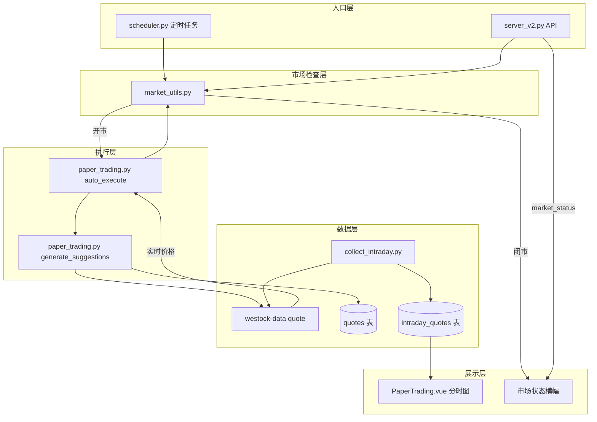

## 产品概述

完善纸面交易（模拟交易）功能，解决三个核心问题：在非交易时段执行买卖不合理、行情价格可能过期或无效、缺少分时数据记录和可视化。

## 核心功能

### 1. 开市时间检查

A股交易时段校验（周一至周五 9:30-11:30, 13:00-15:00），在纸面交易的三个入口层（定时任务、API调用、核心执行函数）全部增加检查，非交易时段拒绝执行买卖并记录日志。

### 2. 行情价格有效性检查

在生成交易建议时，校验价格是否有效——当 quotes 表价格为空或回退到预测 entry_zone 时，不生成买入/卖出建议，改为 hold。同时，执行交易前通过 westock-data quote 获取实时价格，确保成交价是真实的市价而非日K收盘价。

### 3. 实时行情采集与分时存储

新建 `collect_intraday.py` 脚本，开市期间每30秒调用 westock-data quote 获取自选股实时行情，存入新建的 `intraday_quotes` 表。支持手动触发和自动调度两种模式。

### 4. 分时图可视化

前端 PaperTrading.vue 增加分时走势图区域，从 `/api/v2/paper/intraday/{code}` 接口获取数据，用 Chart.js 渲染折线图，展示当日价格变化趋势。

### 5. 市场状态提示

前端在市场关闭/非交易日时展示提示横幅，API 返回 market_status 字段告知当前状态。

## 技术栈

- **后端**：Python 3.12 + FastAPI（server_v2.py）
- **脚本**：Python（paper_trading.py, collect_intraday.py, scheduler.py, market_utils.py）
- **数据库**：SQLite（stock.db），新增 intraday_quotes 表
- **前端**：Vue 3 + TypeScript + Pinia + Chart.js（PaperTrading.vue）
- **数据源**：westock-data Node.js 插件（quote 命令实时行情）

## 实现方案

### 整体策略

以新建 `market_utils.py` 为基础设施，在纸面交易全链路（scheduler → API → auto_execute → generate_suggestions）构建三层市场检查防护。同时新建 `intraday_quotes` 表和 `collect_intraday.py` 采集脚本，实现分时数据的存储和前端可视化。

### 架构设计



### 数据流

1. **开市检查流程**：任何触发入口 → `is_market_open()` → 是则继续，否则记录日志并返回状态
2. **实时价格采集**：`collect_intraday.py` 启动 → 循环(每30秒) → westock-data quote 批量获取 → 写入 intraday_quotes → 同时更新 quotes 表
3. **交易执行流程**：auto_execute → market check → generate_suggestions → 检查价格有效性 → 用实时报价执行交易
4. **分时图展示**：前端请求 `/api/v2/paper/intraday/{code}` → 查询 intraday_quotes → 返回时间序列数据 → Chart.js 渲染

### 目录结构

```
project-root/
├── scripts/
│   ├── market_utils.py          # [NEW] 市场时间工具。is_market_open(dt) 判断开市状态；get_market_status(dt) 返回 'open'/'closed'/'non_trading_day'；时间范围 9:30-11:30 / 13:00-15:00
│   ├── collect_intraday.py      # [NEW] 分时采集脚本。启动后每30秒循环调用 westock-data quote 获取自选股实时行情，写入 intraday_quotes 和更新 quotes 表。支持 --once 单次采集和持续运行模式
│   ├── paper_trading.py         # [MODIFY] auto_execute() 143行前加 market check；generate_suggestions() 109行加价格有效性判断；执行交易前用 westock-data quote 获取实时价格
│   └── scheduler.py             # [MODIFY] task_paper_trading() 66行前加 market check
├── server_v2.py                  # [MODIFY] api_paper_suggestions() 增加 market check + market_status 返回 + 修复重复return；新增 api_intraday 接口；paper account 接口也增加 market_status
├── scripts/db_helper.py          # [MODIFY] init_backtest_tables() 中新增 intraday_quotes 建表；新增 get_intraday_quotes() 和 insert_intraday_quotes() 函数
└── deliverables/v2/src/
    ├── api/paper.js              # [MODIFY] 新增 fetchIntraday() API 函数
    ├── stores/paper.js           # [MODIFY] 新增 intradayData 状态和 loadIntraday 方法
    └── pages/PaperTrading.vue    # [MODIFY] 增加市场状态横幅（marketStatus ref + 条件渲染）；增加分时图卡片区域（canvas + Chart.js 折线图）
```

### 关键代码结构

**intraday_quotes 表结构**：

```sql
CREATE TABLE IF NOT EXISTS intraday_quotes (
    id INTEGER PRIMARY KEY AUTOINCREMENT,
    code TEXT NOT NULL,
    timestamp TEXT NOT NULL,          -- 'YYYY-MM-DD HH:MM:SS'
    price REAL NOT NULL,
    change_pct REAL DEFAULT 0,        -- 涨跌幅%
    volume INTEGER DEFAULT 0,          -- 成交量
    created_at TEXT DEFAULT (datetime('now','localtime')),
    FOREIGN KEY (code) REFERENCES stocks(code)
);
CREATE INDEX IF NOT EXISTS idx_iq_code_ts ON intraday_quotes(code, timestamp);
```

**market_utils.py 核心接口**：

```python
def is_market_open(dt=None) -> bool: ...
def get_market_status(dt=None) -> str: ...  # 'open' | 'closed' | 'non_trading_day'
```

**collect_intraday.py 核心逻辑**：

```python
COLLECT_INTERVAL = 30  # 秒

def fetch_live_quote(market_code: str) -> dict: ...
def collect_once(): ...  # 单次采集，用于 --once
def collect_loop(): ...  # 持续采集，用于持续运行模式
```

### 实现注意事项

- **性能**：intraday_quotes 每天每股票约480条（4小时*2条/分钟），需要定期清理（保留最近90天），采集时使用 `is_market_open()` 自动启停
- **日志**：所有拦截和采集行为通过 `sys.stderr.write` 记录，与现有风格一致
- **向后兼容**：不修改 CLI 参数和现有返回值格式，仅增加提前返回和字段
- **幂等性**：auto_execute 的 executed=1 幂等检查保持不变
- **实时价格**：交易时通过 subprocess 调用 westock-data quote 获取实时价，timeout 设为10秒
- **Chart.js**：前端已使用 Chart.js（Kline.vue），复用相同版本和引入方式

## 使用的扩展

### SubAgent

- **code-explorer**
- 用途：在实现过程中探索代码库，查找具体API引用、类型定义和调用链
- 预期结果：获取完整的函数签名、导入路径和依赖关系

### Skill

- **verification-before-completion**
- 用途：完成所有修改后验证功能正确性，检查语法、导入和逻辑完整性
- 预期结果：确认所有文件无语法错误，逻辑完整，互不冲突