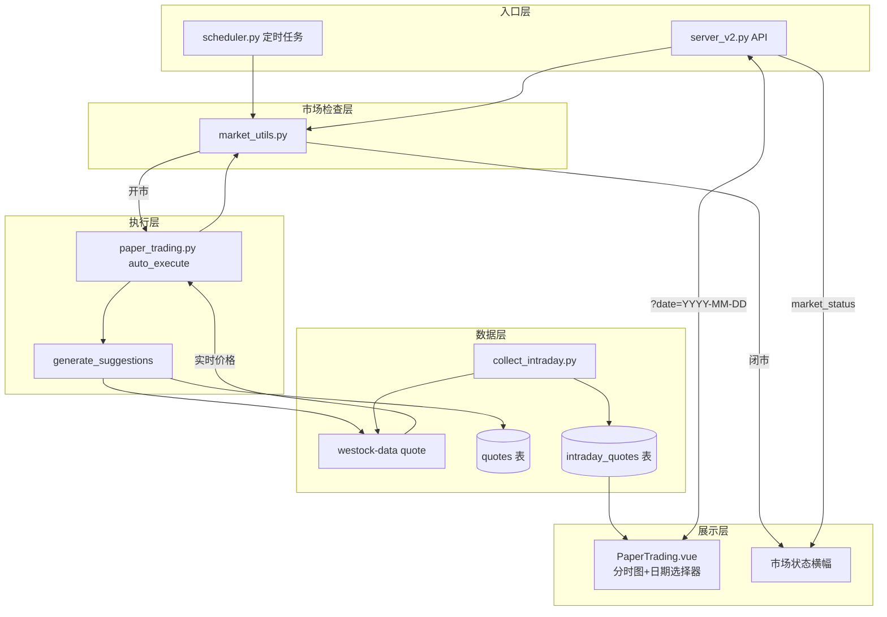

## 产品概述

完善纸面交易（模拟交易）功能，解决四个核心问题：非交易时段执行买卖不合理、行情价格过期或无效、缺少实时分时数据记录、分时图无法回顾历史日期。

## 核心功能

### 1. 开市时间检查

A股交易时段校验（周一至周五 9:30-11:30, 13:00-15:00），在纸面交易的三个入口层（定时任务、API调用、核心执行函数）全部增加检查，非交易时段拒绝执行买卖并记录日志。

### 2. 行情价格有效性检查

在生成交易建议时校验价格是否有效——当 quotes 表价格为空或回退到预测 entry_zone 时，不生成买入/卖出建议，改为 hold。同时，执行交易前通过 westock-data quote 获取实时价格，确保成交价是真实市价而非日K收盘价。

### 3. 实时行情采集与分时存储

新建 `collect_intraday.py` 脚本，开市期间每30秒调用 westock-data quote 获取自选股实时行情，存入新建的 `intraday_quotes` 表。支持手动触发（--once）和持续运行两种模式。按天自动清理，保留最近90天数据。

### 4. 分时图可视化 + 日期选择器

前端 PaperTrading.vue 增加分时走势图区域，包含日期选择器（`<input type="date">` 默认选中当日）。API 端点 `/api/v2/paper/intraday/{code}?date=YYYY-MM-DD`，date 为空时默认返回当日数据。用 Chart.js 折线图渲染选中日期的价格变化趋势，X轴为时间、Y轴为价格。

### 5. 市场状态提示

前端在市场关闭/非交易日时展示提示横幅，API 返回 market_status 字段（`open`/`closed`/`non_trading_day`）告知当前状态。

## 技术栈

- **后端**：Python 3.12 + FastAPI（server_v2.py）
- **脚本**：Python（paper_trading.py, collect_intraday.py, scheduler.py, market_utils.py）
- **数据库**：SQLite（stock.db），新增 intraday_quotes 表
- **前端**：Vue 3.4 + Pinia 2.1 + Chart.js（全局 window.Chart，CDN 加载）
- **数据源**：westock-data Node.js 插件（quote 命令，腾讯自选股实时行情）

## 实现方案

### 整体策略

新建 `market_utils.py` 为基础设施，在纸面交易全链路（scheduler → API → auto_execute → generate_suggestions）构建三层市场检查防护。同时新建 `intraday_quotes` 表和 `collect_intraday.py` 采集脚本，实现分时数据的存储和前端可视化。前端分时图带日期选择器，API 支持 `?date=` 参数筛选历史数据。

### 架构设计



### 数据流

1. **开市检查**：任何触发入口 → `is_market_open()` → 是则继续，否则记录日志并返回状态
2. **实时采集**：`collect_intraday.py` → 每30秒循环 → westock-data quote 批量获取 → 写入 intraday_quotes + 同步更新 quotes 表
3. **交易执行**：auto_execute → market check → generate_suggestions → 检查价格有效性 → 调 quote 取实时价 → 执行交易
4. **分时图查询**：前端选择日期 → `GET /api/v2/paper/intraday/{code}?date=YYYY-MM-DD` → 查询 intraday_quotes → 时间序列 JSON → Chart.js 折线图

### 目录结构

```
project-root/
├── scripts/
│   ├── market_utils.py          # [NEW] is_market_open(dt), get_market_status(dt)
│   ├── collect_intraday.py      # [NEW] 每30秒采集，支持 --once 和持续模式
│   ├── paper_trading.py         # [MODIFY] auto_execute()+generate_suggestions() 加检查
│   └── scheduler.py             # [MODIFY] task_paper_trading() 加兜底检查
├── server_v2.py                  # [MODIFY] 纸面API加检查+新增分时接口+修bug
├── scripts/db_helper.py          # [MODIFY] 新增 intraday_quotes 表+读写函数
└── deliverables/v2/src/
    ├── api/paper.js              # [MODIFY] 新增 fetchIntraday(code, date)
    ├── stores/paper.js           # [MODIFY] 新增 intradayData/selectedDate/loadIntraday
    └── pages/PaperTrading.vue    # [MODIFY] 市场横幅+日期选择器+分时图折线图
```

### 关键数据结构

**intraday_quotes 表**：

```sql
CREATE TABLE IF NOT EXISTS intraday_quotes (
    id INTEGER PRIMARY KEY AUTOINCREMENT,
    code TEXT NOT NULL,
    timestamp TEXT NOT NULL,          -- 'YYYY-MM-DD HH:MM:SS'
    price REAL NOT NULL,
    change_pct REAL DEFAULT 0,
    volume INTEGER DEFAULT 0,
    created_at TEXT DEFAULT (datetime('now','localtime')),
    FOREIGN KEY (code) REFERENCES stocks(code)
);
CREATE INDEX IF NOT EXISTS idx_iq_code_ts ON intraday_quotes(code, timestamp);
CREATE INDEX IF NOT EXISTS idx_iq_code_date ON intraday_quotes(code, date(timestamp));
```

**market_utils.py 接口**：

- `is_market_open(dt=None) -> bool`：判断是否在 9:30-11:30 或 13:00-15:00（周一至周五）
- `get_market_status(dt=None) -> str`：返回 `'open'` / `'closed'` / `'non_trading_day'`

**API 接口**：

- `GET /api/v2/paper/intraday/{code}?date=YYYY-MM-DD`：返回 `{ code, date, data: [{timestamp, price, change_pct, volume}, ...] }`
- 现有 `/api/v2/paper/suggestions` 返回值新增 `market_status` 字段

**Store 新增状态**：

- `intradayData`：`ref([])` — 当前选中日期的分时数据
- `selectedDate`：`ref('')` — 当前选中的日期（默认当日）
- `availableDates`：`ref([])` — 有分时数据的日期列表
- `loadIntraday(code, date)`：异步加载函数

### 实现注意事项

- **Chart.js 复用**：使用 `window.Chart`（全局 CDN），与 Kline.vue/Trades.vue 等现有页面一致，不需要 npm 安装
- **日期选择器**：使用原生 `<input type="date">`，设置默认值为当日 `new Date().toISOString().slice(0,10)`，max 限制为当日
- **性能**：intraday_quotes 每天每股票约480条（4小时×2条/分钟），保留90天约 90×10×480=43万条，SQLite 无压力
- **日志**：所有拦截和采集行为通过 `sys.stderr.write` 记录，与现有风格一致
- **向后兼容**：不修改 CLI 参数和现有返回值格式，仅增加字段和提前返回
- **幂等性**：auto_execute 的 `executed=1` 幂等检查保持不变
- **实时价**：交易时通过 subprocess 调用 `westock-data quote`，timeout=10秒
- **采集启停**：`collect_intraday.py` 使用 `is_market_open()` 自动控制采集启停，非开市时 sleep 等待

## 使用的扩展

### SubAgent

- **code-explorer**
- 用途：在实现过程中探索代码库，查找具体 API 引用、类型定义和调用链
- 预期结果：获取完整的函数签名、导入路径和依赖关系，确保修改准确无误

### Skill

- **verification-before-completion**
- 用途：完成所有修改后验证功能正确性，检查语法、导入和逻辑完整性
- 预期结果：确认所有文件无语法错误，逻辑完整，前后端互不冲突