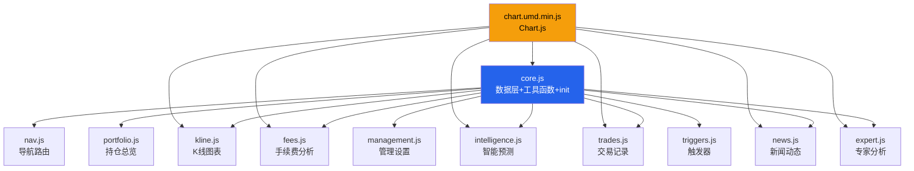

## 用户需求

将 `deliverables/bank-stock-system.html`（2588行单文件）按功能模块拆分为独立的 CSS、JS 模块和精简后的 HTML 入口文件。拆分需遵循高内聚、低耦合原则，每个模块职责单一，并明确模块间的通信与依赖关系。

## 产品概述

股票投资管理系统是一个单页应用（SPA），包含持仓总览、K线走势、交易记录、手续费分析、智能预测、新闻动态、专家分析、管理设置等9个功能页面。运行时通过本地服务器（server.py，端口8765）提供 API 数据，使用 Chart.js 进行图表可视化。

## 核心功能

- **数据层**：15路并行 API 数据加载、缓存管理、配置存储
- **导航路由**：顶部多级导航菜单、页面切换、股票标签动态生成
- **持仓总览**：资产统计卡片、当前持仓表格、分红明细、股价实时刷新
- **K线图表**：日K线+均线+分红标记、股息率走势图、月度涨跌、季节性规律、滚轮缩放平移
- **交易记录**：交易流水表格、月度交易时间线图表
- **手续费分析**：费用构成饼图、逐月趋势柱状图、各股票费率明细
- **智能预测**：次日内预测、6月价格展望、关键价位、技术信号统计
- **新闻动态**：新闻时间线、日期选择器日历控件、情绪趋势图表、新闻详情页
- **专家分析**：专家报告列表、决策卡片、雷达图、多空对比图、风险三角图
- **管理设置**：监控股票增删、A股自动补全搜索、对账单/专家JSON上传

## 技术栈

- 前端：原生 HTML + CSS + JavaScript（ES5兼容）
- 图表引擎：Chart.js（chart.umd.min.js）+ 自定义 kline-chart.js
- 后端 API：Python（server.py，端口8765）
- 无构建工具，通过 `<script>` 标签直接加载模块

## 实现策略

### 拆分策略

采用 **"CSS 抽离 + JS 模块化 + HTML 精简"** 的三层拆分方案：

1. **CSS 层**：将所有 `<style>` 内容提取到独立 CSS 文件
2. **JS 层**：按功能域拆分为 10 个独立 JS 模块，通过全局 `App` 命名空间通信
3. **HTML 层**：保留页面结构，按正确依赖顺序引入外部资源

### 模块通信设计

使用全局 `App` 命名空间作为模块间的通信桥梁，避免循环依赖：



### 关键设计决策

**1. 全局命名空间 App 模式**

- 所有模块通过 `window.App` 共享状态（DATA、CONFIG、_cache）
- 工具函数挂载到 `App.utils.*`（fmt、fmtMoney、pnlClass 等）
- 页面渲染函数挂载到 `App.*`（renderKline、renderNews 等）
- 优点：无需模块打包器，兼容当前 `<script>` 标签加载方式

**2. core.js 承担基础设施**

- 从现有内联 JS 的 700-939 行提取：API_BASE、apiCall()、loadData()、_cache、init()
- 声明全局状态变量（DATA、CONFIG）
- 挂载公共工具函数

**3. 去除代码重复**

- `scripts/render_intelligence.js` 与 HTML 内联 JS 的 `renderIntelligence()` 完全重复
- 重构后统一使用 `intelligence.js`，删除旧的 `scripts/render_intelligence.js`

**4. 向后兼容**

- HTML 页面 ID/class 保持不变
- 所有 onclick 内联事件处理保持不变
- 外部引用 API 路径不变

## 性能与可靠性

- **加载顺序**：严格按依赖链排列 `<script>` 标签（Chart.js → core.js → 功能模块）
- **缓存友好**：CSS 和 JS 分离后浏览器可独立缓存
- **错误隔离**：每个模块用 IIFE 包裹，单个模块加载失败不影响其他模块
- **全局错误处理**：保留 `window.onerror` 和 `unhandledrejection` 处理器

## 目录结构

```
deliverables/
├── bank-stock-system.html    # [MODIFY] 精简后的入口 HTML，仅保留页面结构和 script 引用
├── css/
│   └── app.css               # [NEW] 提取全部 CSS 样式（321行），保持原有选择器不变
├── js/
│   ├── core.js               # [NEW] 数据层基础设施：API_BASE、apiCall、loadData、_cache、init()、全局状态变量、工具函数
│   ├── nav.js                # [NEW] 导航路由：pageGroups、showPage()、导航菜单交互（openNavGroup/closeNavGroup/toggleNavGroup/toggleNavMenu）、genStockTabs()
│   ├── portfolio.js          # [NEW] 持仓总览：renderHoldingsOverview()、refreshQuotes()
│   ├── kline.js              # [NEW] K线图表：renderKline()、calcSMA()、setupKlineZoomPan()、switchKline()、股息率走势图渲染
│   ├── trades.js             # [NEW] 交易记录：交易表格渲染、renderTimeline()
│   ├── fees.js               # [NEW] 手续费分析：renderFeeChart()、renderFeeTrend()
│   ├── intelligence.js       # [NEW] 智能预测：renderIntelligence()、switchIntelStock()、switchIntelTab()、switchIntelDate()、dirIcon/dirText()
│   ├── news.js               # [NEW] 新闻动态：renderNews()、filterNews()、switchNews()、日期选择器控件、新闻详情页 openNewsDetail()、情绪图表
│   ├── expert.js             # [NEW] 专家分析：renderExpertList()、renderExpertDetail()、selectExpert()、switchExpertStock()、雷达图、多空对比、风险三角
│   ├── management.js         # [NEW] 管理设置：refreshWatchlistUI()、股票自动补全搜索、addStock()、removeStock()、switchToKline()
│   └── triggers.js           # [NEW] 触发器+上传：triggerNews/Predict/Expert/Audit()、handleFileSelect()、uploadStatement()、handleExpertFile()、importExpertReport()
└── chart.umd.min.js          # [KEEP] Chart.js 库，不动

scripts/
└── render_intelligence.js    # [DELETE] 与 intelligence.js 重复，删除
```

## 关键代码结构

### core.js 模块接口

```javascript
// 全局命名空间
window.App = window.App || {};

// 状态
App.DATA = null;           // 接口数据
App.CONFIG = {};           // 系统配置
App._cache = {};           // API缓存
App.API_BASE = '';

// API层
App.apiCall = function(method, path, body) { ... };
App.loadData = function(key, endpoint) { ... };
App.init = async function() { ... };   // 15路并行加载

// 工具函数
App.utils = {
  fmt: function(n, d) { ... },
  fmtMoney: function(n) { ... },
  pnlClass: function(v) { ... },
  pnlSign: function(v) { ... },
  getStockName: function(code) { ... },
  getWatchlist: function() { ... },
  hasAPI: function() { ... },
  escapeHtml: function(s) { ... }
};
```

### 模块间通信约定

- 所有页面渲染函数通过 `window.App.renderXxx()` 调用
- 股票代码通过 `App.currentKlineCode` / `App.currentPredCode` 等全局变量共享
- genStockTabs 由 nav.js 提供，被 kline/intelligence/news/expert 等模块调用
- Chart 实例变量（klineChartInst 等）保持在各自模块闭包内或挂载到 App 上

## 使用的扩展

### Skill

- **writing-plans**
- 用途：生成结构化的实现计划，包含精确的文件路径、代码结构和任务分解
- 预期结果：产生一份完整的重构实施计划文档，保存在 `docs/plans/` 目录下

### SubAgent

- **code-explorer**
- 用途：在重构过程中需要精确提取各模块的代码边界时，跨文件搜索确认函数调用关系
- 预期结果：确认每个 JS 函数的完整代码范围，确保拆分不遗漏任何逻辑