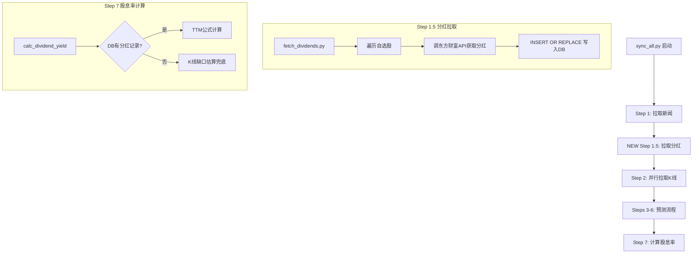

## 产品概述

通过三层改造实现股息率走势统一：1) 从东方财富公开API拉取所有自选股的历史分红数据，写入本地数据库；2) 集成到主同步流程中，确保K线拉取后计算股息率时有完整数据；3) 后端和前端统一为 TTM推算 标签和实线红色样式，消除"K线预估"和"TTM推算"两种模式并存的困惑。

## 核心功能

- 新建 `fetch_dividends.py`，使用 `urllib.request` 调用东方财富分红接口，拉取11只自选股的全部历史分红（日期、金额、除权日），以 `source='web'` 写入 dividends 表
- 利用已有 `INSERT OR REPLACE` + `UNIQUE(code,date,amount)` 索引自动与本地对账单记录合并去重
- 将分红拉取插入 sync_all.py 流程：Step 1.5（新闻之后、K线之前），确保 Step 7 计算股息率时 dividends 表有完整数据
- 后端 `db_helper.py` 将 K线预估的 `is_estimated` 固定为 `False`，`source` 统一为 `ttm_calculated`
- 前端 `bank-stock-system.html` 移除所有 `dyEstimated` 条件分支，统一显示"股息率(TTM推算)"实线红色样式

## Tech Stack

- 编程语言：Python 3（标准库，不引入第三方依赖）
- HTTP 客户端：`urllib.request`（与项目现有 `verify_step2.py`、`run_tests.py` 模式一致）
- 数据库：SQLite（stock.db，现有 dividends 表）
- 前端：原生 JavaScript + Chart.js（现有架构）

## 实现方案

### 架构设计



### 数据流

1. **网络拉取** (`fetch_dividends.py`)：`urllib.request` → 东方财富API → 解析JSON → `INSERT OR REPLACE` 写入 `dividends` 表
2. **合并去重**：已有 UNIQUE 索引 `(code, date, amount)` 自动合并 web/statement 来源
3. **TTM计算** (`db_helper.py`)：`get_dividends()` 从DB读取 → 计算 per_share → TTM窗口求和 / 收盘价 × 100
4. **前端展示**：API `/api/v2/dividend-yield-series` 返回统一数据 → Chart.js 实线红色渲染

### 关键设计决策

- **不使用 pip install requests**：项目当前仅使用 Python 标准库，新增 `fetch_dividends.py` 沿用 `urllib.request` 避免引入新依赖
- **K线预估保留但不标记**：`_estimate_dividends_from_kline()` 保留作为最终兜底（API不可用时降级），但 `is_estimated` 始终为 `False`、`source` 统一为 `ttm_calculated`，前端不再区分
- **数据优先级**：INSERT OR REPLACE 基于 amount 去重，如果 API 和本地对账单有同一笔分红（相同金额），只保留一条，source 字段保留最后写入的值

### 性能考量

- 东方财富API单次调用返回一只股票的完整分红历史，11只股票串行调用，每只有 1s 超时保护
- 时间/空间复杂度：O(n) 串行遍历，n ≤ 11，每次约 200ms~1s
- 瓶颈在网络IO，使用简单重试机制（最多2次），不引入线程池避免过度设计

## 目录结构

```
scripts/
├── fetch_dividends.py    # [NEW] 网络分红拉取脚本
│   - fetch_dividend_history(code) → list[dict]: 拉取单只股票全部分红历史
│   - fetch_all() → int: 遍历所有自选股，返回总计写入条数
│   - upsert_dividends(code, records): 写入DB，INSERT OR REPLACE
│   - 独立运行: python scripts/fetch_dividends.py
│   - 模块导入: from fetch_dividends import fetch_all
│
├── sync_all.py            # [MODIFY] 在Step 1与Step 2之间插入分红拉取
│   - 新增 Step 1.5: 调用 fetch_dividends.fetch_all()
│   - 异常处理和日志输出对齐现有风格
│
└── db_helper.py           # [MODIFY] 第818行/822行修改
    - is_estimated = False
    - source 改为 'ttm_calculated'

deliverables/
└── bank-stock-system.html # [MODIFY] 第1198~1316行统一TTM推算样式
    - 移除 dyEstimated 条件分支
    - 统一实线红色/标签/tooltip/hint文字
```

## 关键代码结构

### fetch_dividends.py 核心接口

```python
# 函数签名
def fetch_dividend_history(code: str) -> list[dict]:
    """从东方财富API拉取单只股票完整分红历史。
    Returns: [{'date': '2025-06-15', 'amount': 0.50, 'ex_date': '2025-06-12'}, ...]
    """

def upsert_dividends(code: str, records: list[dict]) -> int:
    """批量写入 dividends 表，INSERT OR REPLACE 去重。
    Returns: 实际写入的记录数
    """

def fetch_all() -> dict:
    """遍历所有自选股拉取分红，返回汇总信息。
    Returns: {'total': 45, 'stocks': {'601166': 5, ...}, 'errors': []}
    """
```

### INSERT OR REPLACE 格式

```sql
INSERT OR REPLACE INTO dividends(code, date, amount, price, ex_date, source)
VALUES (?, ?, ?, ?, ?, 'web')
-- UNIQUE索引 (code, date, amount) 自动处理重复
```

## Agent Extensions

### SubAgent

- **code-explorer**
- Purpose: 在编写 fetch_dividends.py 时验证东方财富API的实际响应格式和字段名
- Expected outcome: 确认API端点URL、请求参数、响应JSON结构，确保解析代码正确

### Skill

- **writing-plans**
- Purpose: 当前计划已完成，用于后续步骤执行前的确认
- Expected outcome: 计划结构完整，各部分清晰可执行