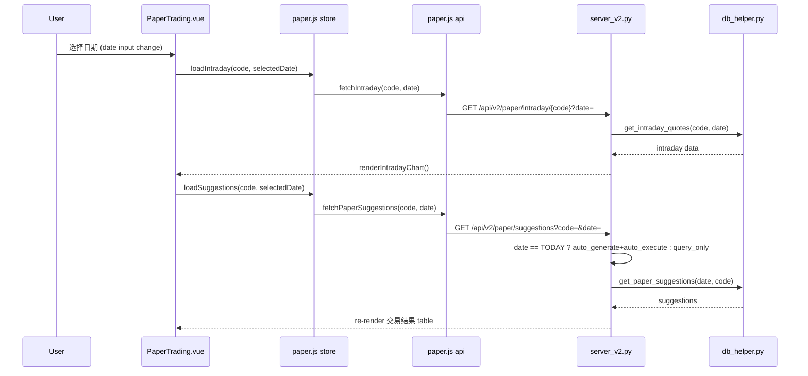

## 用户需求

核心需求：日历选中日期变化时，**分时走势图**和**今日交易结果**板块都要自动同步到对应日期的数据。

约束条件：

- 虚拟账户、虚拟持仓、今日交易结果三者当前已关联（通过 `auto_execute` 联动），无需额外修改账户体系或 Schema
- 虚拟持仓始终显示当前持仓状态，**不随日期变化**
- 当查询历史日期时，不触发 `generate_suggestions` 和 `auto_execute`，仅查询已存储的建议记录

## 产品概述

为 PaperTrading 页面实现完整的日期驱动数据同步：用户通过日历选择任意日期后，分时走势图绘制该日的分钟级价格曲线，交易结果表格展示该日的算法建议/执行记录，标题从固定的"今日交易结果"变为日期感知的动态标题。

## 核心功能

- 日期切换同时同步分时走势图 + 交易结果
- 查询历史日期时仅读取已存储的 suggestions，不自动生成或执行交易
- 查询今天（TODAY）时保持现有行为：自动生成建议 + 自动执行交易
- 动态标题：今天显示"今日交易结果"，历史日期显示"YYYY-MM-DD 交易结果"

## 技术栈

- 后端：Python + FastAPI（`server_v2.py`），SQLite 数据库
- 前端：Vue 3 + Pinia + Chart.js，Vite 构建
- 数据库访问：`scripts/db_helper.py`（`get_paper_suggestions` 已支持 `date` 参数）

## 实现方案

### 整体策略

**最少侵入原则**：仅修改 API 签名和前端调用链，不涉及数据库变更或新表创建。`db_helper.get_paper_suggestions(date, code)` 已原生支持日期参数，后端只需透传。

### 数据流

### 关键决策

1. **历史日期不触发 auto_execute**：通过 `if date != TODAY` 条件跳过自动生成和执行逻辑，防止查询历史数据时误修改账户/持仓状态。
2. **默认行为不变**：不传 `date` 参数时默认使用 `TODAY`，保证向后兼容。
3. **前端调用链传递**：`PaperTrading.vue` → `store.loadSuggestions(code, date)` → `api.fetchPaperSuggestions(code, date)` → `server GET /api/v2/paper/suggestions?code=&date=`。

## 实现注意事项

- **向后兼容**：API 新增 `date` 参数为可选，不传时行为与现有完全一致
- **安全性**：历史日期查询路径完全不涉及任何写操作
- **onCodeChange 同步**：切换股票时也同步 suggestions（不同股票可能在不同日期有不同建议）
- **初始化不改**：`onMounted` 中的初始 `loadSuggestions()` 仍不传参，默认拉取今日数据