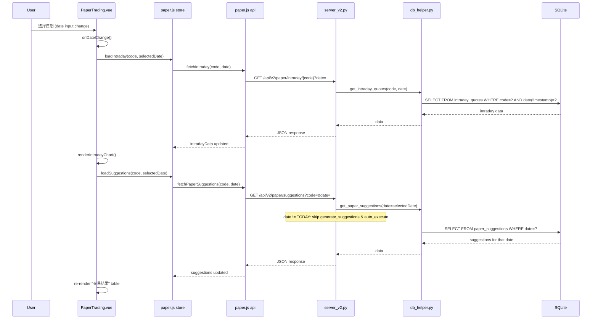

## 用户需求

### 需求1：虚拟账户体系统一管理

将虚拟持仓归属到虚拟账户体系下，实现账户层级的资金与持仓数据统一管理。当前 `paper_positions`、`paper_trades`、`paper_suggestions` 表均缺少 `account_id` 外键，无法将数据归属到具体虚拟账户。

### 需求2：日期驱动的数据同步

实现基于日期驱动的数据同步机制。用户通过日历选择不同日期后，分时走势图与今日交易结果（suggestions）必须自动且实时地同步更新，确保历史回测与当日交易状态的准确性与连贯性。

### 当前问题

- **后端硬编码 TODAY**：`api_paper_suggestions` 始终使用系统日期 `TODAY`，不接受 `date` 参数；自动执行交易也只基于 TODAY
- **前端日期不同步**：`selectedDate` 仅驱动分时走势图（`loadIntraday`），"今日交易结果"区域始终调用 `loadSuggestions()`（不传日期）
- **持仓/trades 无日期上下文**：无法按历史日期查看对应交易数据

## 技术栈

- **后端**：Python + FastAPI（`server_v2.py`），SQLite 数据库
- **前端**：Vue 3 + Pinia + Chart.js，Vite 构建
- **数据库访问**：`scripts/db_helper.py` 封装所有 SQL 操作
- **交易引擎**：`scripts/paper_trading.py` 负责建议生成与自动执行

## 实现方案

### 整体策略

采用**增量迁移 + 向后兼容**的方式，分三层修改：数据库层、后端 API 层、前端层。

### 数据库层修改

为 `paper_positions`、`paper_trades`、`paper_suggestions` 三张表添加 `account_id INTEGER REFERENCES paper_account(id)` 外键列，默认值设为 1（映射现有单账户）。在 `init_backtest_tables()` 中添加 ALTER TABLE 迁移逻辑，兼容已有数据库。

### 后端 API 修改

1. **`GET /api/v2/paper/suggestions`**：新增可选 `date` 查询参数。当 `date` 为历史日期时，仅查询已存储的 suggestions（不触发 `generate_suggestions` 和 `auto_execute`）；当 `date` 为 TODAY 时，保持现有自动生成+执行逻辑。

2. **`GET /api/v2/paper/positions`**：新增可选 `date` 参数。为未来按历史日期查看持仓快照预留接口，当前保持查询实时持仓。

3. **`GET /api/v2/paper/trades`**：新增可选 `date` 参数，按日期过滤交易记录。

4. **账户相关 API**：`get_paper_account` 和 `get_paper_positions` 的查询添加 `account_id` 过滤，确保数据归属正确。

### 前端修改

1. **API 层**（`deliverables/v2/src/api/paper.js`）：`fetchPaperSuggestions` 和 `fetchPaperTrades` 新增 `date` 参数。

2. **Store 层**（`deliverables/v2/src/stores/paper.js`）：`loadSuggestions(code, date)` 和 `loadTrades(code, limit, offset, date)` 支持传递日期参数。

3. **页面层**（`deliverables/v2/src/pages/PaperTrading.vue`）：

- `onDateChange` 中增加调用 `loadSuggestions(intradayCode.value, selectedDate.value)` 和 `loadTrades`，实现日期变化时交易结果自动同步
- 动态标题：当 `selectedDate` 为今天时显示"今日交易结果"，否则显示"YYYY-MM-DD 交易结果"
- `onCodeChange` 中也同步 suggestions（不同股票对应不同交易建议）

### 数据流

### 实现注意事项

- **向后兼容**：所有新增列设 DEFAULT 1，已有数据不受影响；API 新增参数均为可选，不传时保持原有行为
- **安全性**：历史日期查询时跳过 `auto_execute`，防止误触发交易执行
- **日志**：后端打印 Paper API 日志时包含 `date` 参数信息，便于调试
- **性能**：账户查询仅查最新一行（`ORDER BY id DESC LIMIT 1`），无需额外索引