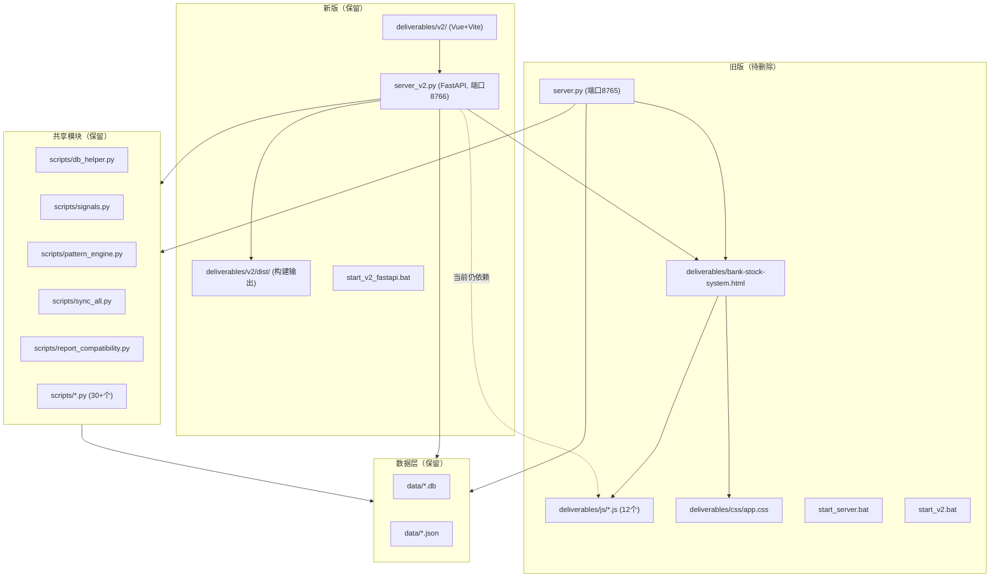

## 渐进式重构清理方案：彻底移除旧版代码

### 方案目标

对股票投资管理系统进行渐进式重构，彻底移除旧版前端（HTML/JS/CSS）和旧版后端（server.py），同时保持新版系统的功能完整性和运行稳定性。

### 方案范围

- **移除目标**：旧版后端 server.py、旧版单页前端 deliverables/bank-stock-system.html 及关联静态资源、旧启动脚本、旧版专用工具脚本
- **保留内容**：新版后端 server_v2.py（FastAPI）、新版 Vue+Vite 前端 (deliverables/v2/)、共享 scripts/ 目录下的数据库/信号/同步模块、data/ 数据目录

### 方案输出要求

1. 依赖梳理（调用链、共享模块、接口）
2. 影响评估（风险分析）
3. 迁移策略（分阶段执行步骤）
4. 验证标准（测试与回滚）

## 1. 依赖关系梳理

### 1.1 系统架构全景图



### 1.2 详细依赖矩阵

| 旧版文件 | 被谁引用 | 引用方式 | 风险等级 |
| --- | --- | --- | --- |
| `server.py` | `start_server.bat`, `start_v2.bat` | 直接启动 | 低（脚本可删） |
| `deliverables/bank-stock-system.html` | `server_v2.py:692` | `_serve_file_content()` 路由 `/` | **高** |
| `deliverables/js/*.js` (12个) | `bank-stock-system.html` + `server_v2.py:1473` 路由 `/deliverables/{path}` | HTML 内部引用 + HTTP 静态服务 | **高** |
| `deliverables/css/app.css` | 同上 | 同上 | **高** |
| `deliverables/chart.umd.min.js` | `bank-stock-system.html` + V2 dist | HTML 引用 | 中（V2 dist 有独立副本） |
| `deliverables/kline-chart.js` | 仅旧版 HTML | HTML 引用 | 低 |
| `scripts/reinject_from_db.py` | `server_v2.py:1278,1454` | `run_script()` 调用 | **高**（需移除调用） |
| `scripts/add_ui_features.py` | 仅旧版 HTML | 直接修改 HTML | 低（旧版专用） |
| `scripts/check_html.py` | 仅旧版 HTML | 旧版调试 | 低 |
| `scripts/fix_head.py` | 仅旧版 HTML | 旧版修复 | 低 |
| `scripts/validate_data.py` | 仅旧版 HTML | 旧版验证 | 低 |
| `scripts/verify_step2.py` | 仅旧版 HTML | 旧版验证 | 低 |
| `scripts/verify_step3.py` | 仅旧版 HTML | 旧版验证 | 低 |


### 1.3 server_v2.py 中旧版依赖的具体代码位置

| 位置 | 代码 | 用途 | 清理方式 |
| --- | --- | --- | --- |
| L688-692 | `@app.get("/")` → `_serve_file_content("deliverables/bank-stock-system.html")` | 首页路由 | 改为服务 V2 dist index.html |
| L1473-1482 | `@app.get("/deliverables/{rest_of_path:path}")` | 旧前端静态资源 | 删除路由 |
| L1278 | `run_script("reinject_from_db.py", 30)` | 对账单更新后注入旧 HTML | 删除调用 |
| L1453-1461 | `run_script("reinject_from_db.py", 30)` + 错误处理 | 文件上传后注入旧 HTML | 删除调用块 |


### 1.4 新版前端中旧版端口引用

| 文件 | 位置 | 内容 | 风险 |
| --- | --- | --- | --- |
| `Management.vue:241` | `"端口8765"` | 状态文本硬编码 | 低（纯显示） |
| `Placeholder.vue:36` | `legacyUrl = http://localhost:8765` | 旧版入口链接 | 低（占位页面） |
| `client.js:3` | 注释 `"调用 http://127.0.0.1:8765"` | 注释文字 | 低 |


## 2. 影响评估

### 2.1 高风险变更

| 变更 | 风险 | 缓解措施 |
| --- | --- | --- |
| 修改根路由 `/` 指向 V2 dist | 若 V2 构建损坏则首页不可用 | 先验证 V2 dist 完整性，保留旧文件作回退 |
| 删除 `/deliverables/{path}` 路由 | 无其他消费者 | 确认旧 HTML 已移除后安全删除 |
| 删除 `reinject_from_db.py` 调用 | 对账单上传将不再尝试注入 HTML | 改为仅返回数据写入成功消息 |


### 2.2 低风险变更

| 变更 | 理由 |
| --- | --- |
| 删除旧版 HTML/JS/CSS | 仅被 server_v2.py 路由和旧版 HTML 自身引用 |
| 删除 server.py | 仅被 start_server.bat/start_v2.bat 引用 |
| 删除旧前端专用脚本 | 确认 server_v2.py 无其他调用 |


### 2.3 零风险变更

| 变更 | 理由 |
| --- | --- |
| 前端引用修复 (端口号文字) | 不影响逻辑，纯展示/注释 |
| 删除空文件/调试文件 | 无任何引用 |


## 3. 迁移策略（分6阶段执行）

### 第一阶段：准备与安全备份

- 使用 [mcp:GitHub] 创建 clean-old-code 分支
- 验证 V2 前端构建完整性（deliverables/v2/dist/ 是否存在且包含 index.html）
- 记录当前 git 状态以便回滚

### 第二阶段：后端解耦（server_v2.py）

- 修改根路由 `/` 改为服务 `deliverables/v2/dist/index.html`
- 添加 V2 dist 静态资源路由（`/assets/{path}` 映射到 `deliverables/v2/dist/assets/`）
- 添加 chart 文件路由（`/chart.umd.min.js`, `/chartjs-chart-financial.min.js`）
- 删除 `/deliverables/{path}` 通用静态路由
- 删除 `reinject_from_db.py` 的两个调用点及其错误处理逻辑

### 第三阶段：前端引用清理

- 修改 `Management.vue:241`："端口8765" → "端口8766"
- 修改 `Placeholder.vue`：移除 legacyUrl 引用（该页面作为占位符，未来迁移完成时可删除或更新）
- 修改 `client.js:3` 注释更新端口号
- 重新构建 V2 前端

### 第四阶段：删除旧版服务器与启动脚本

- 删除 `server.py`
- 删除 `start_server.bat`
- 删除 `start_v2.bat`
- 重命名 `start_v2_fastapi.bat` → `start.bat`

### 第五阶段：删除旧版前端文件与专用脚本

- 删除 `deliverables/bank-stock-system.html` 及备份文件（.bak2, .reject_bak）
- 删除 `deliverables/js/` 整个目录（12个 JS 文件）
- 删除 `deliverables/css/` 整个目录
- 删除 `deliverables/kline-chart.js`
- 删除 `deliverables/chart.umd.min.js`（V2 dist 有独立副本）
- 删除 `scripts/reinject_from_db.py`
- 删除 `scripts/add_ui_features.py`, `scripts/check_html.py`, `scripts/fix_head.py`, `scripts/validate_data.py`
- 删除 `scripts/verify_step2.py`, `scripts/verify_step3.py`
- 删除 `scripts/_debug_xy.py`
- 删除根目录垃圾文件：`_debug_flow.py`, `'`（空文件名）, `3`（空文件名）

### 第六阶段：最终验证

- 启动 server_v2.py 验证后端启动无报错
- 访问各 API 端点验证返回正常数据
- 访问首页验证 V2 前端正常加载
- 执行 `scripts/audit_system.py` 验证数据完整性
- 执行 `scripts/run_tests.py` 验证测试套件通过
- 使用 [mcp:GitHub] 创建 Pull Request

## 4. 验证标准与回滚机制

### 4.1 各阶段验证标准

| 阶段 | 前置条件 | 验证方法 | 通过标准 |
| --- | --- | --- | --- |
| 第一阶段 | - | git status 确认分支创建 | 分支创建成功，dist 目录存在 |
| 第二阶段 | 第一阶段通过 | 启动 server_v2.py，访问 http://localhost:8766 | V2 前端正常加载，旧 HTML 不再服务 |
| 第三阶段 | 第二阶段通过 | 构建 V2 前端 | 构建无报错 |
| 第四阶段 | 第三阶段通过 | 确认旧启动脚本已删除 | 仅 start.bat 存在 |
| 第五阶段 | 第四阶段通过 | 确认所有旧文件已删除 | 预期删除的文件不再存在 |
| 第六阶段 | 全部通过 | 全量测试 | 所有 API 通过，前端正常 |


### 4.2 核心测试用例

```
1. API 连通性测试
   - GET /api/v2/init → 返回 {success: true, data: {...}}
   - GET /api/v2/config → 返回配置数据
   - GET /api/v2/watchlist → 返回自选股列表
   
2. 前端加载测试
   - GET / → 返回 V2 dist index.html（200 OK）
   - GET /assets/index-*.js → 返回 JS 资源（200 OK）
   - GET /assets/index-*.css → 返回 CSS 资源（200 OK）
   
3. 对账单上传测试
   - POST /api/upload/statement → 数据写入 DB，不再调用 reinject_from_db
   
4. 数据完整性测试
   - 运行 scripts/audit_system.py
   - 运行 scripts/run_tests.py
```

### 4.3 回滚机制

| 级别 | 触发条件 | 回滚操作 |
| --- | --- | --- |
| **轻量回滚** | 单个文件修改出错 | git checkout -- <file> 恢复该文件 |
| **阶段回滚** | 某阶段验证未通过 | git reset --hard 回到该阶段开始前的 commit |
| **整体回滚** | 关键功能异常 | 使用 [mcp:GitHub] 撤销整个 clean-old-code 分支的 PR |


每个阶段完成后创建独立 git commit，commit message 格式：

```
chore(cleanup): [Phase N] 阶段描述
```

## 5. 目录结构变更

### 变更前

```
project-root/
├── server.py                          # 旧版后端
├── server_v2.py                       # 新版后端 [保留]
├── start_server.bat                   # 旧版启动脚本
├── start_v2.bat                       # 旧版组合启动脚本
├── start_v2_fastapi.bat               # 新版启动脚本 [重命名为 start.bat]
├── _debug_flow.py                     # 垃圾文件
├── ' (空文件名)                        # 垃圾文件
├── 3 (空文件名)                        # 垃圾文件
├── deliverables/
│   ├── bank-stock-system.html         # 旧版前端 [删除]
│   ├── bank-stock-system.html.bak2    # 备份 [删除]
│   ├── bank-stock-system.html.reject_bak  # 备份 [删除]
│   ├── js/ (12个文件)                 # 旧版 JS [删除]
│   ├── css/app.css                    # 旧版 CSS [删除]
│   ├── kline-chart.js                 # 旧版图表库 [删除]
│   ├── chart.umd.min.js               # 旧版图表库 [删除]
│   └── v2/ (Vue+Vite 前端)           # [保留]
├── scripts/
│   ├── reinject_from_db.py            # 旧版专用 [删除]
│   ├── add_ui_features.py             # 旧版专用 [删除]
│   ├── check_html.py                  # 旧版专用 [删除]
│   ├── fix_head.py                    # 旧版专用 [删除]
│   ├── validate_data.py               # 旧版专用 [删除]
│   ├── verify_step2.py                # 旧版专用 [删除]
│   ├── verify_step3.py                # 旧版专用 [删除]
│   ├── _debug_xy.py                   # 调试文件 [删除]
│   └── ... (30+个共享脚本)           # [保留]
└── data/                              # [保留]
```

### 变更后

```
project-root/
├── server_v2.py                       # 唯一后端
├── start.bat                          # 唯一启动脚本（原名 start_v2_fastapi.bat）
├── deliverables/
│   └── v2/ (Vue+Vite 前端)           # 唯一前端
└── scripts/ (共享模块)                # 仅保留业务脚本
└── data/                              # 数据目录不变
```

## Agent Extensions 应用

### MCP - GitHub

- **用途**: 在每阶段执行前创建 git 分支和提交，确保版本控制和可回滚
- **预期产出**: 
- 创建 `clean-old-code` 分支
- 每阶段完成后创建独立 commit（共6个 commit）
- 最终创建 Pull Request 用于代码审核

### MCP - Cloud Studio Sandbox

- **用途**: 清理完成后，创建 Cloud Studio 工作空间验证部署
- **预期产出**: 创建工作空间实例，确认清理后的代码可正常部署运行

### Skill - executing-plans

- **用途**: 将本方案作为执行计划导入，分阶段执行并设置审查节点
- **预期产出**: 每个阶段执行完毕后在审查节点确认，确保无意外变更

### Skill - verification-before-completion

- **用途**: 在每阶段完成声明的末尾，执行验证命令确认预期结果
- **预期产出**: 通过命令输出确认每阶段目标已达成，确保不做虚假完成声明

### SubAgent - code-explorer

- **用途**: 在第二阶段（后端解耦）和第五阶段（删除脚本）执行前，再次全面扫描确认无隐藏引用
- **预期产出**: 生成完整的引用关系报告，确保无遗漏的依赖关系