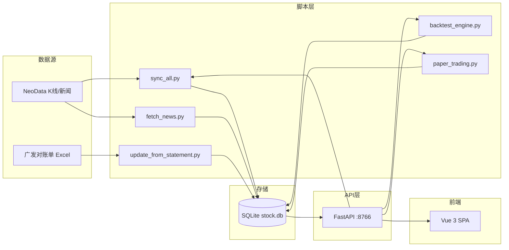

# 股票投资管理系统 V2 — 规格文档总览

> **系统版本**: V0.9 | **文档版本**: v4.1 | **更新日期**: 2026-06-12
> **定位**: 个人银行股投资管理系统（纯本地运行）
> **架构**: Vue 3 SPA + FastAPI RESTful + SQLite

---

## 系统概述

本地运行的银行股投资管理单页应用：

| 维度 | 说明 |
|------|------|
| 用户角色 | 个人投资用户（单人使用，无多用户/权限） |
| 数据来源 | 广发证券对账单 Excel（持仓/交易）+ NeoData 公开 API（实时行情/新闻/分红） |
| 数据规模 | 自选股 3-10 只（银行股为主），每只日K线 200~2000 条 |
| 运维模式 | 仅日常同步/刷新操作 |

---

## 技术栈

| 层 | 技术选型 |
|----|---------|
| **数据库** | SQLite 3（WAL 模式，20+ 张表） |
| **后端** | Python 3.12+ / FastAPI + Uvicorn（端口 :8766） |
| **前端** | Vue 3 + Pinia + Vue Router + Chart.js（Vite 构建） |
| **外部数据** | NeoData / 东方财富 API / 广发证券对账单 Excel |

---

## 启动方式

```bash
# 推荐
python server_v2.py
# 访问 http://localhost:8766
# 或
start.bat
```

---

## 文档导航

### 系统基础层

| 文件 | 内容 |
|------|------|
| [01-system-architecture.md](./01-system-architecture.md) | 系统架构、FastAPI 服务层、脚本编排、前后端通信 |
| [02-database-layer.md](./02-database-layer.md) | SQLite 数据库设计、查询/写入函数、数据完整性约束 |
| [03-data-sync-engine.md](./03-data-sync-engine.md) | 全量数据同步引擎（sync_all.py 8步流程） |
| [04-self-learning-engine.md](./04-self-learning-engine.md) | 10 信号技术分析 + MWU 自学习 + 预测生成算法 |
| [05-task-scheduler.md](./05-task-scheduler.md) | 定时任务调度引擎（外部定时器驱动） |

### 个人交易数据（菜单分组一）

| 文件 | 前端页面 | 核心功能 |
|------|---------|---------|
| [06-positions-overview.md](./06-positions-overview.md) | Overview.vue | 持仓总览：当前持仓、已清仓、分红汇总、盈亏统计 |
| [07-trade-records.md](./07-trade-records.md) | Trades.vue | 交易记录：历史交易明细、交易类型筛选 |
| [08-fee-analysis.md](./08-fee-analysis.md) | Fees.vue | 手续费分析：佣金/印花税/其他费用统计 |
| [09-system-management.md](./09-system-management.md) | Management.vue | 管理设置：自选股管理、对账单上传、系统触发 |

### 股票分析预测（菜单分组二）

| 文件 | 前端页面 | 核心功能 |
|------|---------|---------|
| [10-intelligence-prediction.md](./10-intelligence-prediction.md) | Intelligence.vue | 智能预测：10天滚动预测、10信号详情、分时走势 |
| [11-expert-analysis.md](./11-expert-analysis.md) | Expert.vue | 专家分析：五维雷达图、多空辩论、综合建议 |

### 股票信息收集（菜单分组三）

| 文件 | 前端页面 | 核心功能 |
|------|---------|---------|
| [12-news-feed.md](./12-news-feed.md) | News.vue | 新闻动态：自选股新闻抓取、情感分析、重大性判断 |
| [13-kline-charts.md](./13-kline-charts.md) | Kline.vue | K线走势：日K/月K线图表、形态识别 |
| [14-pattern-rules.md](./14-pattern-rules.md) | PatternRules.vue | 形态规则：33条K线形态规则管理、形态扫描 |
| [18-company-relations-graph.md](./18-company-relations-graph.md) | CompanyGraph.vue 🔹新增 | 公司关系图谱：股权结构/高管关联/供应链/竞争关系网络可视化 |

### 模拟交易（菜单分组四）

| 文件 | 前端页面 | 核心功能 |
|------|---------|---------|
| [15-backtest-engine.md](./15-backtest-engine.md) | BacktestPage.vue | 回测分析：Walk-forward优化、网格搜索权重、性能指标 |
| [16-paper-trading.md](./16-paper-trading.md) | PaperTrading.vue | 纸面交易：虚拟账户、自动交易执行、每日建议 |
| [17-paper-history.md](./17-paper-history.md) | PaperHistory.vue | 交易历史：资金曲线图、统计摘要、交易明细 |

### 附录

| 文件 | 内容 |
|------|------|
| [appendix-a-database-schema.md](./appendix-a-database-schema.md) | 数据库 20+ 张表的完整字段定义 |
| [appendix-b-api-reference.md](./appendix-b-api-reference.md) | API 端点完整清单（70+ 端点） |
| [appendix-c-configuration.md](./appendix-c-configuration.md) | 系统配置项说明 |
| [appendix-d-dependencies.md](./appendix-d-dependencies.md) | 模块间依赖关系与数据流 |
| [appendix-e-glossary.md](./appendix-e-glossary.md) | 术语表 |
| [appendix-f-known-issues.md](./appendix-f-known-issues.md) | 已知问题与性能基线 |

---

## 系统菜单结构

```
App.vue 导航栏
├── 🔹 个人交易数据
│   ├── 持仓总览     → /overview
│   ├── 交易记录     → /trades
│   ├── 手续费分析   → /fees
│   └── 管理设置     → /manage
├── 🔹 股票分析预测
│   ├── 智能预测     → /intelligence
│   └── 专家分析     → /expert
├── 🔹 股票信息收集
│   ├── 新闻动态     → /news
│   ├── K线走势      → /kline
│   ├── 形态规则     → /pattern-rules
│   └── 公司关系图谱  → /company-graph  🔹新增
└── 🔹 模拟交易
    ├── 回测分析     → /backtest
    ├── 纸面交易     → /paper
    └── 交易历史     → /paper/history
```

---

## 关键数据流



---

## 文档约定

| 约定 | 说明 |
|------|------|
| 代码引用 | `文件名:行号` |
| API 路径 | `/api/v2/...` |
| 数据库表 | `表名` |
| 配置项 | `配置键` |

---

## 更新历史

| 版本 | 日期 | 说明 |
|------|------|------|
| v4.2 | 2026-06-15 | 新增 18-company-relations-graph 公司关系图谱规格文档 |
| v4.1 | 2026-06-12 | 新增 intraday_quotes 分钟数据及日K线降级方案文档 |
| v4.0 | 2026-06-06 | 按菜单结构完全重写，22个文件覆盖全部功能 |
| v3.0 | 2026-06-06 | 移除旧版代码引用，V2纯系统架构 |
