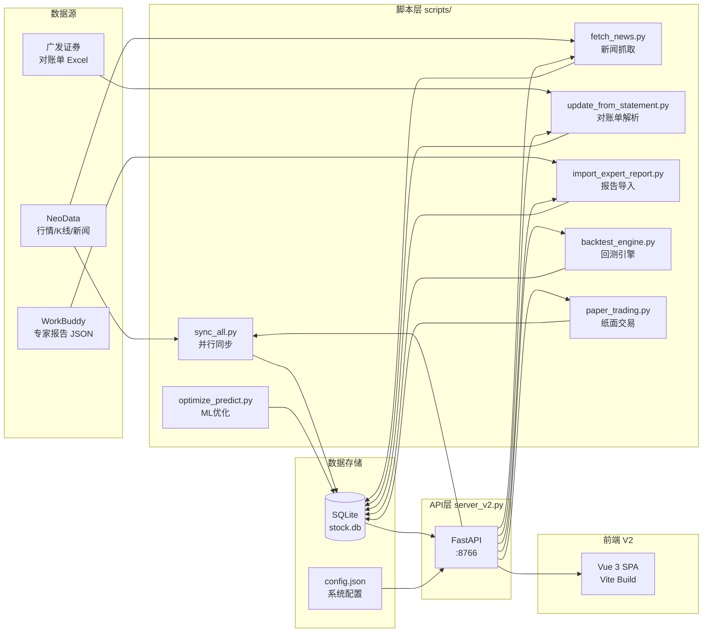

# 股票投资管理系统 — 规格文档总览

> **系统版本**: V0.9 | **文档版本**: v3.0 | **更新日期**: 2026-06-06
> **定位**: 个人银行股投资管理系统（纯本地运行）
> **架构**: SPA + RESTful API + SQLite

---

## 系统概述

本地运行的银行股投资管理单页应用：

| 维度 | 说明 |
|------|------|
| 用户角色 | 个人投资用户（单人使用，无需多用户/权限） |
| 数据来源 | 广发证券对账单 Excel（持仓/交易）+ 东方财富公开 API（实时行情/新闻/分红） |
| 数据规模 | 自选股 3-10 只（银行股为主），每只日K线 200~2000 条 |
| 运维模式 | 仅日常同步/刷新操作，gRPC/微服务/K8s 等无需求 |

---

## 技术栈

| 层 | 技术选型 |
|----|---------|
| **数据库** | SQLite 3（WAL 模式，17 张表） |
| **后端** | Python 3.12+ / FastAPI + Uvicorn |
| **前端** | Vue 3 + Pinia + Vue Router + Chart.js（Vite 构建） |
| **外部数据** | NeoData / 东方财富 API / 广发证券对账单 Excel |

---

## 启动方式

```bash
# 方式一（推荐）：启动 V2 系统
python server_v2.py
# 访问 http://localhost:8766

# 方式二：使用启动脚本
start.bat
```

---

## 文档导航

```
docs/specs/
├── README.md                        ← 你现在在这里
├── 01-api-server.md                 Web API 服务层（server_v2.py）
├── 02-database-layer.md             SQLite 数据库操作层（db_helper.py）
├── 03-sync-engine.md                全模块同步引擎（sync_all.py）
├── 04-self-learning.md              自学习预测引擎（signals.py）
├── 05-daily-update.md               每日数据更新（部分废弃，保留 ML 更新）
├── 06-scheduler.md                  定时任务调度（scheduler.py）
├── 07-news-fetcher.md               新闻抓取（fetch_news.py）
├── 08-stock-database.md             A 股数据库构建（build_stock_db.py）
├── 09-statement-parser.md           广发对账单解析（parse_statement.py）
├── 10-expert-report.md              专家报告导入（import_expert_report.py）
├── 11-data-injection.md             ⚠️ 已废弃（旧版 HTML 数据注入，V2 不再需要）
├── 12-migration-and-audit.md        数据迁移与审计（migrate_to_sqlite.py / audit_system.py）
├── 13-ml-prediction-optimization.md  ML 预测优化（optimize_predict.py）
├── 14-backtest-paper-trading.md     回测引擎与纸面交易技术方案（V0.9）
├── 14-analysis.md                   技术方案深度分析
├── 14-business-requirements.md      业务需求说明书
├── 14-user-flow.md                  用户操作流程
├── appendix-a-schema.md             数据库表结构
├── appendix-b-api.md                API 端点清单
├── appendix-c-config.md             配置文件说明
├── appendix-d-dependencies.md       依赖关系图与数据流
├── appendix-e-glossary.md           术语表
└── appendix-f-known-issues.md       已知问题
```

### 核心模块（01–06）

| 模块 | 文件 | 功能 |
|------|------|------|
| 01 | `server_v2.py` | FastAPI Web 服务器（端口 :8766），路由分发 + UploadFile + 脚本编排 |
| 02 | `scripts/db_helper.py` | SQLite 唯一读写入口，17 张表的 CRUD（参数化查询） |
| 03 | `scripts/sync_all.py` | 全量数据同步编排器（并行K线→信号→预测→新闻→行情） |
| 04 | `scripts/signals.py` | 10 技术信号 + MWU 在线学习 + 季节性预测引擎 |
| 05 | `scripts/daily_runner.py` | 每日预测同步（ML 更新部分保留） |
| 06 | `scripts/scheduler.py` | 定时任务调度（DAILY / WEEKLY / ON_UPLOAD） |

### 数据管道（07–13）

| 模块 | 文件 | 功能 |
|------|------|------|
| 07 | `scripts/fetch_news.py` | 东方财富 API 新闻抓取 |
| 08 | `scripts/build_stock_db.py` | A 股全量股票数据库构建 |
| 09 | `scripts/parse_statement.py` | 广发对账单 Excel 解析 |
| 10 | `scripts/import_expert_report.py` | 专家分析报告 JSON 导入 |
| 11 | ~~`scripts/reinject_from_db.py`~~ | **已废弃** — V2 前端使用 Vue API 动态获取数据 |
| 12 | `scripts/migrate_to_sqlite.py` / `audit_system.py` | 数据迁移与系统审计 |
| 13 | `scripts/optimize_predict.py` | ML 预测模型优化与回测 |

### 新功能 V0.9（14 系列）

| 文档 | 类型 | 说明 |
|------|------|------|
| 14-backtest-paper-trading.md | 技术设计 | 回测引擎 + 纸面交易实现方案 |
| 14-analysis.md | 技术审查 | 架构/性能/安全/可扩展/可维护深度分析 |
| 14-business-requirements.md | 业务需求 | BRD — 业务背景/痛点/功能点/验收标准 |
| 14-user-flow.md | 用户流程 | 首次使用/每日自动/日常查看完整流程 |

### 附录（A–F）

| 附录 | 内容 |
|------|------|
| A | 数据库 17 张表的字段定义与关系 |
| B | API 端点完整清单（40+ 端点） |
| C | 系统配置项说明 |
| D | 模块间依赖关系与数据流 |
| E | 术语表 |
| F | 已知问题与未来优化方向 |

---

## 关键数据流



### 1. 行情 + 预测流

```
NeoData → sync_all.py（并行K线 / 计算信号 / 生成预测）→ SQLite → API → 前端
```

### 2. 持仓数据流

```
广发对账单.xlsx → update_from_statement.py → SQLite → API → 前端
```

### 3. 新闻流

```
NeoData → fetch_news.py → SQLite → API → 前端
```

### 4. 专家报告流

```
WorkBuddy 多 Agent → POST /api/v2/expert/import → import_expert_report.py → SQLite → GET /api/v2/expert → 前端
```

### 5. 回测与纸面交易流（V0.9）

```
API → backtest_engine.py（Walk-forward 优化）→ learning_params（冷启动权重）
API → paper_trading.py（每日建议+虚拟交易）→ paper_* 表 → API → 前端
```

---

## 文档约定

| 约定 | 说明 |
|------|------|
| 代码引用 | \[`文件名:行号`\] |
| API 路径 | `/api/v2/...` |
| 数据库表 | `表名` |
| 配置项 | `配置键` |
| 版本标记 | ⚠️ 部分废弃 / ✅ 当前版本 / 🚧 开发中 |

---

## 更新历史

| 版本 | 日期 | 说明 |
|------|------|------|
| v3.0 | 2026-06-06 | 移除旧版代码引用：删除 server.py、旧版 HTML 前端、reinject_from_db 等旧版专用脚本；更新架构图为纯 V2 系统 |
| v2.3 | 2026-06-04 | V0.8 升级至 FastAPI，添加 appendix-b（API 端点清单） |
| v2.2 | 2026-06-01 | Vue 3 迁移完成，14 系列文档新增 |
| v2.1 | 2026-05-22 | V0.7 ML 增强同步 |
